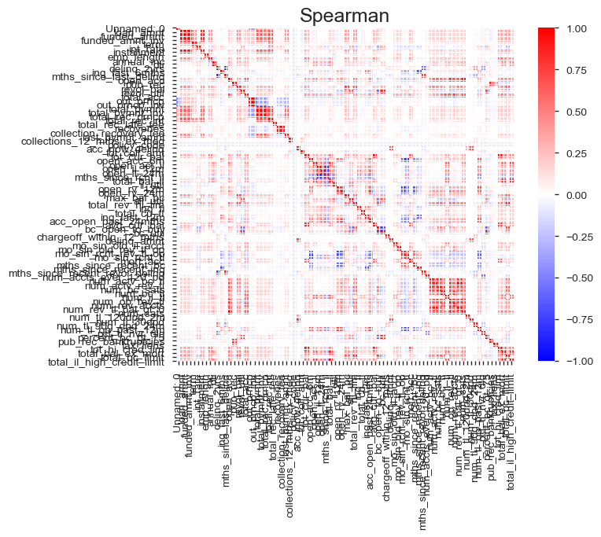

## 1. Problem Identification

#### 1.1. Background: Lending Club

*[LendingClub](https://www.lendingclub.com/) is an American peer-to-peer lending company, headquartered in San Francisco, California. It was the first peer-to-peer lender to register its offerings as securities with the Securities and Exchange Commission (SEC), and to offer loan trading on a secondary market. LendingClub is the world's largest peer-to-peer lending platform. The company claims that $15.98 billion in loans had been originated through its platform up to December 31, 2015.

LendingClub enables borrowers to create unsecured personal loans between $1,000 and $40,000. The standard loan period is three years. Investors can search and browse the loan listings on LendingClub website and select loans that they want to invest in based on the information supplied about the borrower, amount of loan, loan grade, and loan purpose. Investors make money from interest. LendingClub makes money by charging borrowers an origination fee and investors a service fee.[Company Wiki Page](https://en.wikipedia.org/wiki/LendingClub)*

#### 1.2 Problem Statement

In this capstone project, our goal is to create a loan interest rate generator based on the characteristics on each loan. 

## 2. Data Wrangling

#### 2.1. Data Collection

The dataset contains loan data for all loans issued through the 2007-2015, including the current loan status (Current, Late, Fully Paid, etc.) and latest payment information. The file containing loan data through the "present" contains complete loan data for all loans issued through the previous completed calendar quarter. Additional features include credit scores, number of finance inquiries, address including zip codes, and state, and collections among others. The file is a matrix of about 890 thousand observations and 75 variables. The datast is acquired through the Kaggle API by clicking on the links below:

> * [Kaggle Dataset](https://www.kaggle.com/wendykan/lending-club-loan-data)

#### 2.2. Data Definition

We investigate the below features with the help of info(), describe(), and panda profiling. 

    1.	Column Name
    2.	Data Type (numeric, categorical, timestamp, etc)
    3.	Description of Column
    4.	Count or percent per unique values or codes (including NA)
    5.	The range of values or codes

## 3. Data Cleaning

* **Problem 1:** Handling missing data. **Solution:** use fillna() to imputate the missing value with its mean, median or mode. In some cases, just replace the missing data with zeros.

* **Problem 2:** Removing duplicates. **Solution:** use the built in Pandas DataFrame function drop_duplicates(). 

## 4. Exploratory Data Analysis

   

## 5. Pre-processing and Training Data Development

    •	Create dummy or indicator features for categorical variables
    •	Standardize the magnitude of numeric features: minmax or standard scaler
    •	Split into testing and training datasets

## 6. Modeling

#### 6.1. Method

There are two main types of regression models:

1. **Simple Regression:** Use for linear data.

2. **Ensemble Methods :** Random Forest Regression. If the data is nonlinear, Ensemble Method generates better predictions.

**WINNER:Random Forest Regression** 

I choose Random Forest Regressor to accomodate the nonlinear nature of the dataset.

#### Grid Search Cross Validation

I chose to work with the GridSearchCV in sklearn model selection package for training my interest rate model. I varied the n_estimators from 100 to 1100 at the interval of 100.. In the end, the best parameter for n_estimators is 500. 

>***NOTE:** I choose RMSE as the accuracy metric over mean absolute error(MAE) because the errors are squared before they are averaged which gives the RMSE a higher weight to large errors. Thus, the RMSE is useful when large errors are undesirable. The smaller the RMSE, the more accurate the prediction because the RMSE takes the square root of the residual errors of the line of best fit.*

## 7. Future Improvements

* This interest rate model can be further improved by incorporating more qualitative variables that were previously abandoned due to resources constraints. 

* Due to RAM constraints, I had to train a 10% sample of the original dataset. Without resource limitations, I would love to train on the full dataset. Preliminary tests showed that the bigger the training size, the lower the RMSE. 

## 8. Credits

Thanks to Jeremy Cunningham for being an amazing Springboard mentor.
